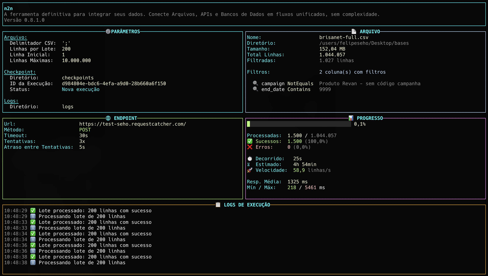

<div align="center">
  <h1>🚀 n2n - Any to Any</h1>
  <p><strong>A ferramenta definitiva para integrar seus dados de qualquer origem com APIs REST</strong></p>

  <p>
    <a href="#-funcionalidades">Funcionalidades</a> •
    <a href="#-requisitos">Requisitos</a> •
    <a href="#-instalação">Instalação</a> •
    <a href="#-quick-start">Quick Start</a> •
    <a href="#-comandos-e-argumentos">Comandos</a> •
    <a href="#-exemplos">Exemplos</a>
  </p>

  <p>
    
    
    
  </p>
</div>

---

## 📋 Sobre o Projeto

**n2n** é uma ferramenta de linha de comando poderosa e eficiente que permite processar arquivos CSV e enviar os dados para APIs REST de forma automatizada. Ideal para migrações de dados, integrações em lote, sincronização de sistemas e automação de processos.

Com uma interface visual moderna e intuitiva, n2n oferece monitoramento em tempo real, sistema de checkpoints para retomada de processamento e suporte a múltiplos endpoints com roteamento dinâmico.

### 💡 Por que usar n2n?

- ✅ **Simplicidade**: Configure em minutos com arquivos YAML
- ✅ **Performance**: Processamento em lote com paralelismo otimizado
- ✅ **Confiabilidade**: Sistema de checkpoints e retry automático
- ✅ **Flexibilidade**: Múltiplos endpoints, transformações e filtros de dados
- ✅ **Visibilidade**: Dashboard em tempo real com métricas detalhadas

---

## 🖼️ Interface Moderna



### ✨ Recursos Visuais

O n2n utiliza [Spectre.Console](https://spectreconsole.net/) para oferecer uma experiência de console rica e moderna:

- 🎨 **Banner ASCII Art** estilizado
- 📊 **Dashboard de métricas** em tempo real
- 📈 **Barras de progresso** animadas e responsivas
- 🎯 **Tabelas formatadas** para configurações e resultados
- 🌈 **Cores temáticas** para diferentes tipos de mensagens
- ⚡ **Spinners animados** durante operações assíncronas

---

## ✨ Funcionalidades

### 🎯 Processamento de Dados
- ✅ **Leitura inteligente de CSV** com processamento em lotes configuráveis
- ✅ **Validação robusta** com regex e formatos de data personalizados
- ✅ **Filtros avançados** para processar apenas linhas específicas
- ✅ **20+ transformações de dados** (uppercase, format-cpf, slugify, etc.)

### 🌐 Integração com APIs
- ✅ **Múltiplos endpoints** com roteamento dinâmico por linha
- ✅ **Métodos HTTP** (POST/PUT) com headers customizados
- ✅ **Autenticação** Bearer Token e API Keys
- ✅ **Payloads aninhados** (ex: `address.street`, `user.profile.name`)

### 🚀 Performance e Confiabilidade
- ✅ **Processamento paralelo** otimizado para alta performance
- ✅ **Sistema de checkpoints** com UUID único por execução
- ✅ **Retry automático** com backoff configurável
- ✅ **Rate limiting** para controle de requisições

### 🛠️ Operação e Monitoramento
- ✅ **Dashboard em tempo real** com métricas detalhadas
- ✅ **Logs estruturados** com rastreamento completo de erros
- ✅ **Modo dry-run** para testes sem requisições reais
- ✅ **Argumentos CLI** para sobrescrever configurações rapidamente

---

## 📦 Requisitos

Antes de começar, certifique-se de ter instalado:

- **[.NET 10 SDK](https://dotnet.microsoft.com/download/dotnet/10.0)** ou superior
- **Sistema Operacional**: Windows, macOS ou Linux

### Verificando a instalação

```bash
dotnet --version
# Deve retornar 10.0.x ou superior
```

---

## 🔧 Instalação

### 1️⃣ Clone o repositório

```bash
git clone https://github.com/felipeseho/n2n.git
cd n2n
```

### 2️⃣ Restaure as dependências

```bash
dotnet restore
```

### 3️⃣ Compile o projeto

```bash
dotnet build
```

### 4️⃣ (Opcional) Compile para produção

```bash
dotnet publish -c Release -o ./publish
```

Isso criará um executável otimizado na pasta `publish/`.

---

## 🚀 Quick Start

### Execução Básica

```bash
# Usar configuração padrão (config.yaml)
dotnet run

# Ver todas as opções disponíveis
dotnet run -- --help
```

### Teste Rápido com Webhook.site

Teste a aplicação sem configurar uma API real:

```bash
# 1. Acesse https://webhook.site e copie sua URL única
# 2. Execute com sua URL
dotnet run -- --endpoint "https://webhook.site/SUA-URL-AQUI" --verbose

# 3. Acompanhe as requisições em tempo real no webhook.site
```

### Exemplos de Uso Comum

```bash
# Processar arquivo específico
dotnet run -- --input data/clientes.csv --verbose

# Usar endpoint configurado
dotnet run -- --endpoint-name producao

# Modo de teste (sem requisições reais)
dotnet run -- --dry-run --verbose

# Processar apenas primeiras 100 linhas
dotnet run -- --max-lines 100 --verbose

# Continuar execução a partir de checkpoint
dotnet run -- --execution-id abc-123-def-456 --verbose
```

---

## ⚙️ Comandos e Argumentos

### 📋 Referência Rápida

Todos os argumentos são opcionais e sobrescrevem as configurações do arquivo YAML:

| Argumento | Atalho | Descrição | Exemplo |
|-----------|--------|-----------|---------|
| `--config` | `-c` | Arquivo de configuração YAML | `--config config.yaml` |
| `--input` | `-i` | Arquivo CSV de entrada | `--input data/vendas.csv` |
| `--batch-lines` | `-b` | Linhas processadas por lote | `--batch-lines 500` |
| `--start-line` | `-s` | Linha inicial do processamento | `--start-line 100` |
| `--max-lines` | `-n` | Máximo de linhas a processar | `--max-lines 1000` |
| `--log-dir` | `-l` | Diretório de logs | `--log-dir logs/prod` |
| `--delimiter` | `-d` | Delimitador do CSV | `--delimiter ";"` |
| `--execution-id` | `--exec-id` | UUID para continuar checkpoint | `--exec-id abc-123...` |
| `--endpoint-name` | | Nome do endpoint a ser usado | `--endpoint-name producao` |
| `--verbose` | `-v` | Exibir logs detalhados | `--verbose` |
| `--dry-run` | `--test` | Testar sem fazer requisições | `--dry-run` |

### 💡 Exemplos Práticos

**Processar arquivo com endpoint específico:**
```bash
dotnet run -- -i data/clientes.csv --endpoint-name producao -v
```

**Testar primeiras 50 linhas:**
```bash
dotnet run -- -i data/teste.csv -n 50 --dry-run -v
```

**Processar com delimitador customizado:**
```bash
dotnet run -- -i data/export.csv -d ";" -v
```

**Retomar processamento de um checkpoint:**
```bash
dotnet run -- --execution-id 6869cdf3-5fb0-4178-966d-9a21015ffb4d -v
```

**Processar intervalo específico de linhas:**
```bash
# Linhas 101 a 200
dotnet run -- -s 101 -n 100 -v
```

📚 **Documentação completa**: [CLI-ARGUMENTS.md](docs/CLI-ARGUMENTS.md)

---

## 📝 Exemplos

### Exemplo 1: Configuração Básica

**config.yaml:**
```yaml
file:
  inputPath: "data/usuarios.csv"
  batchLines: 100
  csvDelimiter: ","
  mapping:
    - column: "Nome"
      type: "string"
    - column: "Email"
      type: "string"
      regex: "^[a-zA-Z0-9._%+-]+@[a-zA-Z0-9.-]+\\.[a-zA-Z]{2,}$"

endpoints:
  - name: "api-producao"
    endpointUrl: "https://api.example.com/users"
    method: "POST"
    headers:
      Authorization: "Bearer seu-token-aqui"
    mapping:
      - attribute: "name"
        csvColumn: "Nome"
        transform: "title-case"
      - attribute: "email"
        csvColumn: "Email"
        transform: "lowercase"
```

**Executar:**
```bash
dotnet run -- --verbose
```

### Exemplo 2: Múltiplos Endpoints com Roteamento

**CSV com coluna de roteamento:**
```csv
Nome,Email,API_Destino
João Silva,joao@empresa.com,crm
Maria Santos,maria@empresa.com,erp
Pedro Costa,pedro@empresa.com,crm
```

**config.yaml:**
```yaml
endpointColumnName: "API_Destino"

endpoints:
  - name: "crm"
    endpointUrl: "https://api.crm.com/contacts"
    headers:
      Authorization: "Bearer token-crm"
    mapping:
      - attribute: "fullName"
        csvColumn: "Nome"
      - attribute: "email"
        csvColumn: "Email"

  - name: "erp"
    endpointUrl: "https://api.erp.com/customers"
    headers:
      Authorization: "Bearer token-erp"
    mapping:
      - attribute: "customerName"
        csvColumn: "Nome"
      - attribute: "contactEmail"
        csvColumn: "Email"
```

### Exemplo 3: Transformações e Filtros

```yaml
file:
  mapping:
    - column: "Status"
      type: "string"
      filter:
        operator: "Equals"
        value: "ativo"
        caseInsensitive: true

endpoints:
  - name: "api"
    endpointUrl: "https://api.example.com/customers"
    mapping:
      - attribute: "name"
        csvColumn: "Nome"
        transform: "uppercase"
      - attribute: "cpf"
        csvColumn: "CPF"
        transform: "format-cpf"
      - attribute: "phone"
        csvColumn: "Telefone"
        transform: "format-phone-br"
      - attribute: "source"
        fixedValue: "csv-import-2024"
```

### Exemplo 4: Webhook.site para Testes

```bash
# 1. Acesse https://webhook.site
# 2. Copie sua URL única
# 3. Execute:
dotnet run -- \
  --endpoint "https://webhook.site/SUA-URL-AQUI" \
  --input data/teste.csv \
  --max-lines 10 \
  --verbose

# 4. Acompanhe as requisições em tempo real no navegador
```

📚 **Mais exemplos**: [EXAMPLES.md](docs/EXAMPLES.md)

---

## 🎨 Transformações de Dados

O n2n oferece mais de 20 transformações que podem ser aplicadas aos dados:

### Transformações de Texto
- `uppercase` - TEXTO EM MAIÚSCULAS
- `lowercase` - texto em minúsculas
- `capitalize` - Primeira letra maiúscula
- `title-case` - Primeira Letra De Cada Palavra
- `trim` - Remove espaços nas extremidades

### Formatações Brasileiras
- `format-cpf` - 000.000.000-00
- `format-cnpj` - 00.000.000/0000-00
- `format-phone-br` - (00) 00000-0000
- `format-cep` - 00000-000

### Limpeza de Dados
- `remove-spaces` - Removetodososespaços
- `remove-accents` - Remove acentuacao
- `remove-non-numeric` - 1234567890
- `remove-non-alphanumeric` - SomenteLetrasNumeros

### Outras
- `slugify` - converte-para-url-amigavel
- `base64-encode` - Codifica em Base64
- `url-encode` - Codifica%20para%20URL
- `date-format:DD/MM/YYYY` - Reformata datas

📚 **Lista completa**: [TRANSFORMATIONS.md](docs/TRANSFORMATIONS.md)

---

## 🔍 Filtros de Dados

Processe apenas as linhas que atendem critérios específicos:

```yaml
file:
  mapping:
    - column: "Status"
      type: "string"
      filter:
        operator: "Equals"
        value: "ativo"
        caseInsensitive: true
    
    - column: "Campanha"
      type: "string"
      filter:
        operator: "Contains"
        value: "promo2024"
```

### Operadores Disponíveis
- `Equals` - Valor exatamente igual
- `NotEquals` - Valor diferente
- `Contains` - Contém o texto
- `NotContains` - Não contém o texto

📚 **Documentação completa**: [FILTERS.md](docs/FILTERS.md)

---

## 📊 Sistema de Checkpoints

O n2n salva o progresso automaticamente, permitindo retomar processamentos:

```bash
# Nova execução (gera UUID automaticamente)
dotnet run

# Saída: Execution ID: 6869cdf3-5fb0-4178-966d-9a21015ffb4d

# Continuar execução existente
dotnet run -- --execution-id 6869cdf3-5fb0-4178-966d-9a21015ffb4d
```

Cada execução tem seus próprios arquivos:
- 📝 `logs/process_{uuid}.log`
- 💾 `checkpoints/checkpoint_{uuid}.json`

---

## 📖 Configuração Avançada

### Estrutura Completa do config.yaml

```yaml
file:
  inputPath: "data/input.csv"
  batchLines: 100
  startLine: 1
  maxLines: 1000
  logDirectory: "logs"
  csvDelimiter: ","
  checkpointDirectory: "checkpoints"
  mapping:
    - column: "Nome"
      type: "string"
    - column: "Email"
      type: "string"
      regex: "^[a-zA-Z0-9._%+-]+@[a-zA-Z0-9.-]+\\.[a-zA-Z]{2,}$"

endpointColumnName: "API_Destino"  # Opcional
defaultEndpoint: "producao"         # Opcional

endpoints:
  - name: "producao"
    endpointUrl: "https://api.example.com/v1/users"
    method: "POST"
    headers:
      Authorization: "Bearer token-aqui"
      X-API-Key: "sua-chave-api"
    requestTimeout: 30
    retryAttempts: 3
    retryDelaySeconds: 5
    maxRequestsPerSecond: 10
    mapping:
      - attribute: "name"
        csvColumn: "Nome"
        transform: "title-case"
      - attribute: "email"
        csvColumn: "Email"
        transform: "lowercase"
      - attribute: "address.street"
        csvColumn: "Rua"
      - attribute: "source"
        fixedValue: "csv-import"
```

---

## 🐛 Tratamento de Erros

### Formato do Log de Erros

```csv
LineNumber,Nome,Email,Status,HttpCode,ErrorMessage
5,João Silva,email-invalido,ativo,400,"Email inválido"
8,Maria,maria@email.com,cancelado,500,"Timeout na requisição"
```

### Tipos de Erro

- **400** - Validação de dados (regex, formato)
- **4xx/5xx** - Erros da API (código real do servidor)
- **500** - Exceções (timeout, conexão, etc.)

---

## 🏗️ Estrutura do Projeto

```
n2n/
├── src/
│   ├── Commands/           # Comandos CLI
│   ├── Services/           # Serviços principais
│   ├── Models/             # Modelos de dados
│   ├── Infrastructure/     # Infraestrutura
│   └── Utils/              # Utilitários
├── docs/                   # Documentação
├── data/                   # Dados de exemplo
├── logs/                   # Logs de execução
├── checkpoints/            # Checkpoints salvos
└── config.yaml             # Configuração padrão
```

---

## 🚀 Performance

Otimizações implementadas:

- ✅ **Processamento em lotes** - Evita carregar todo CSV na memória
- ✅ **Paralelismo** - Múltiplas requisições HTTP simultâneas
- ✅ **Thread-safe** - Logging seguro com SemaphoreSlim
- ✅ **Async/await** - Operações I/O não-bloqueantes
- ✅ **Rate limiting** - Controle de taxa de requisições

---

## 📚 Documentação Adicional

- 📖 [Quick Start](docs/QUICKSTART.md) - Guia de início rápido em 5 minutos
- ⚙️ [Argumentos CLI](docs/CLI-ARGUMENTS.md) - Referência completa de comandos
- 💡 [Exemplos](docs/EXAMPLES.md) - Casos de uso práticos
- 🎨 [Transformações](docs/TRANSFORMATIONS.md) - Lista completa de transformações
- 🔍 [Filtros](docs/FILTERS.md) - Guia de filtros de dados
- 📝 [Changelog](docs/CHANGELOG.md) - Histórico de versões

---

## 🤝 Contribuindo

Contribuições são bem-vindas! Sinta-se à vontade para:

1. 🐛 Reportar bugs
2. 💡 Sugerir novas funcionalidades
3. 🔧 Enviar pull requests
4. 📖 Melhorar a documentação

---

## 📄 Licença

Este projeto está licenciado sob a licença MIT - veja o arquivo [LICENSE](LICENSE) para detalhes.

---

## 🛠️ Tecnologias

- **[.NET 10](https://dotnet.microsoft.com/)** - Framework principal
- **[Spectre.Console](https://spectreconsole.net/)** - Interface visual moderna
- **[CsvHelper](https://joshclose.github.io/CsvHelper/)** - Processamento de CSV
- **[YamlDotNet](https://github.com/aaubry/YamlDotNet)** - Parsing de YAML

---

<div align="center">
  <p>Desenvolvido com ❤️ por <a href="https://github.com/felipeseho">Felipe Seho</a></p>
  <p>
    <a href="#-sobre-o-projeto">Voltar ao topo ⬆️</a>
  </p>
</div>

